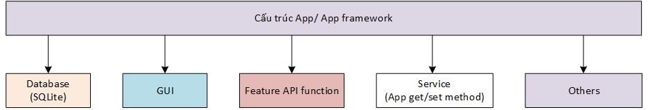
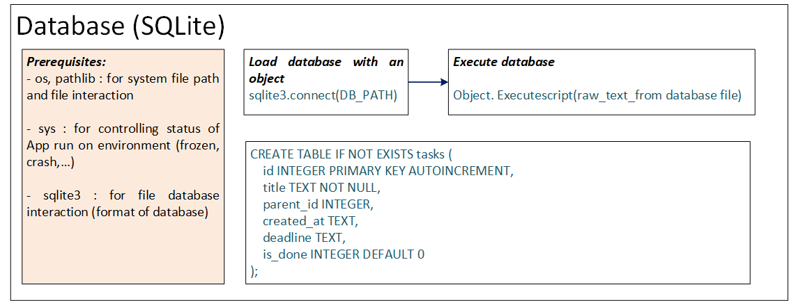
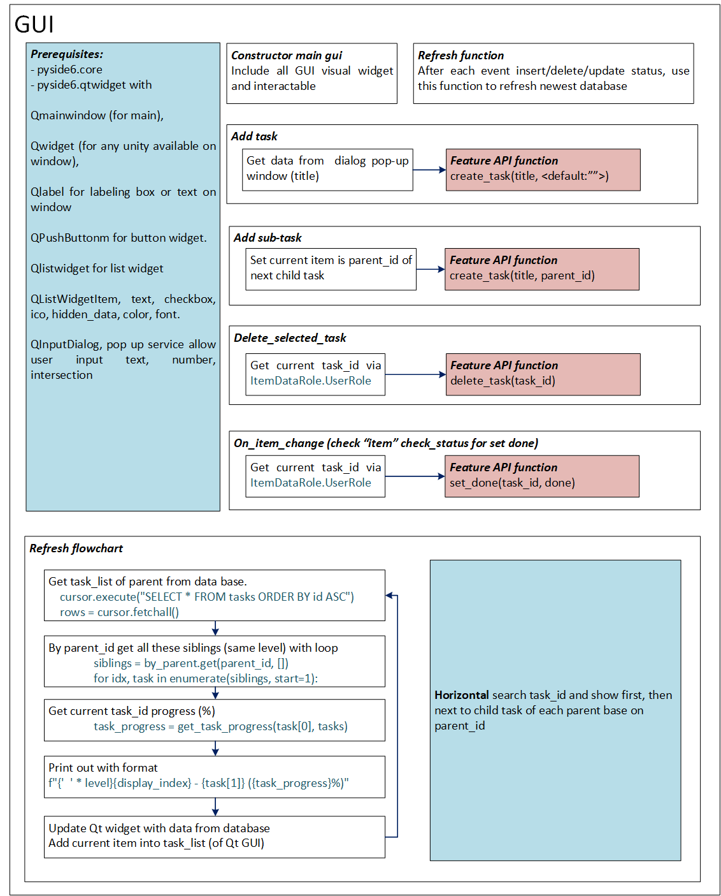
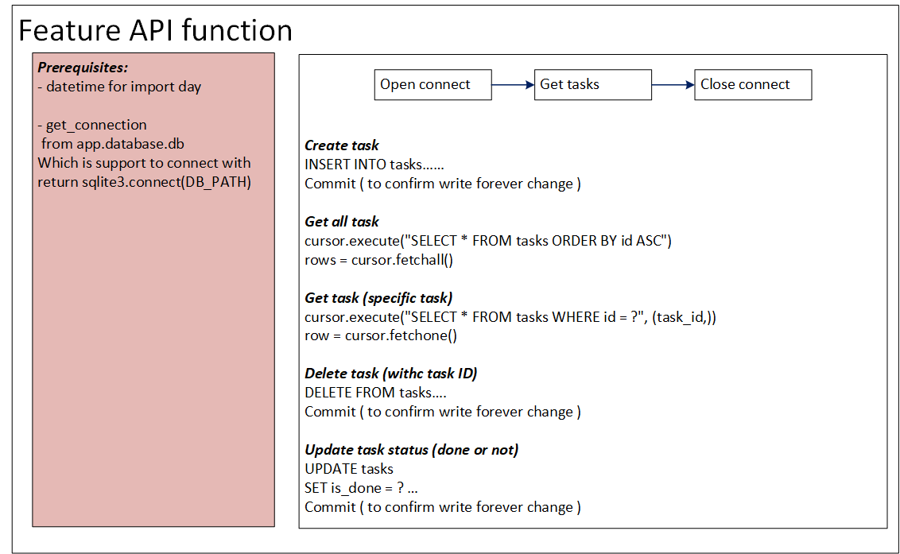
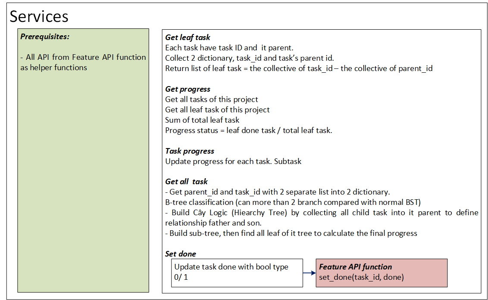

# 📌 Task Planning & Progress Tracking Tool

## 1. 🎯 Mục tiêu

Xây dựng một tool giúp:

* Lên kế hoạch công việc
* Chia nhỏ task theo nhiều cấp (level, subtask)
* Theo dõi tiến độ hoàn thành (%)
* Quản lý task đơn giản qua GUI
* Lưu trữ dữ liệu bằng SQLite

---

## 2. 🧱 Kiến trúc tổng thể

### Thành phần chính

* **GUI**: Giao diện người dùng (tạo / sửa / xóa / xem task)
* **Logic layer**: Xử lý nghiệp vụ (progress, tree, rule)
* **Database (SQLite)**: Lưu trữ dữ liệu

---

## 3. 🗄️ Data Model

### Bảng: `tasks`

| Field      | Type         | Mô tả                          |
| ---------- | ------------ | ------------------------------ |
| id         | INTEGER (PK) | ID task                        |
| title      | TEXT         | Tên task                       |
| parent_id  | INTEGER      | ID task cha (NULL nếu là root) |
| created_at | DATETIME     | Ngày tạo                       |
| deadline   | DATETIME     | Deadline (optional)            |
| is_done    | BOOLEAN      | Trạng thái hoàn thành          |

---

## 4. 🌳 Cấu trúc Task

* Task được tổ chức dạng **tree**
* Hỗ trợ nhiều cấp:

  * Level 1: Task chính
  * Level 2: Subtask (1.1, 1.2)
  * Level 3: Sub-subtask (1.1.1)

👉 Lưu ý:

* Không lưu "1.1.1" trong database
* Chỉ generate khi hiển thị

---

## 5. 📊 Logic tính Progress

### Nguyên tắc

* Chỉ tính trên **leaf task** (task không có con)

### Công thức

```
Progress = (Số leaf task đã hoàn thành) / (Tổng số leaf task)
```

---

### Ví dụ

```
Task A
 ├── Task B
 │    ├── Task D ✅
 │    └── Task E ❌
 └── Task C ✅

→ Progress = 2 / 3 = 66.6%
```

---

## 6. 🔄 Quy tắc xử lý (Business Rules)

### 6.1. Leaf task

* Task không có con
* Chỉ leaf task ảnh hưởng đến progress

---

### 6.2. Mark Done

#### Khi mark leaf:

* Chỉ update chính nó

#### Khi mark parent:

* Tự động mark toàn bộ subtree = done

---

### 6.3. Uncheck

* Uncheck parent → uncheck toàn bộ subtree

---

### 6.4. Xóa task

* Xóa 1 task → xóa toàn bộ subtree (cascade delete)

---

## 7. 🔁 Workflow

### 7.1. Tạo task

```
User → GUI → Create task
→ (optional) add subtask
→ (optional) add nhiều cấp
```

---

### 7.2. Update task

```
User → chọn task → mark done / undo
→ hệ thống cập nhật progress
```

---

### 7.3. Xóa task

```
User → chọn task/subtask → delete
→ hệ thống xóa toàn bộ subtree
```

---

### 7.4. Kiểm tra tiến độ

```
User → chọn task chính
→ hiển thị:
   - Progress (%)
   - Danh sách task (done / not done)
```

---

## 8. 🔔 Notification (MVP)

### Cách hoạt động

* Chạy mỗi ngày
* Lấy danh sách task chưa hoàn thành
* Hiển thị cho user

---

## 9. ⚠️ Edge Cases

* Không có task → progress = 0
* Task đơn → chính nó là leaf
* Task cha done nhưng con chưa done → không hợp lệ (phải auto sync)
* Tránh chia cho 0

---

## 10. 🧩 Core Functions

```python
create_task(title, parent_id=None, deadline=None)

delete_task(task_id)

mark_done(task_id)

unmark_done(task_id)

get_progress(task_id)

get_all_tasks()

get_leaf_tasks()
```

---

## 11. 🚀 Scope MVP

### Bao gồm

* CRUD task
* Tree structure
* Progress calculation
* SQLite storage
* GUI cơ bản

### Không bao gồm (future)

* Weight task
* Sync cloud
* Multi-user
* Advanced notification

---

## 12. 📌 Ghi chú

* UI sẽ được tối ưu sau
* Ưu tiên logic đúng trước
* Thiết kế mở để dễ mở rộng

---

## 13. Chart of tool
<center>
  
</center>








---